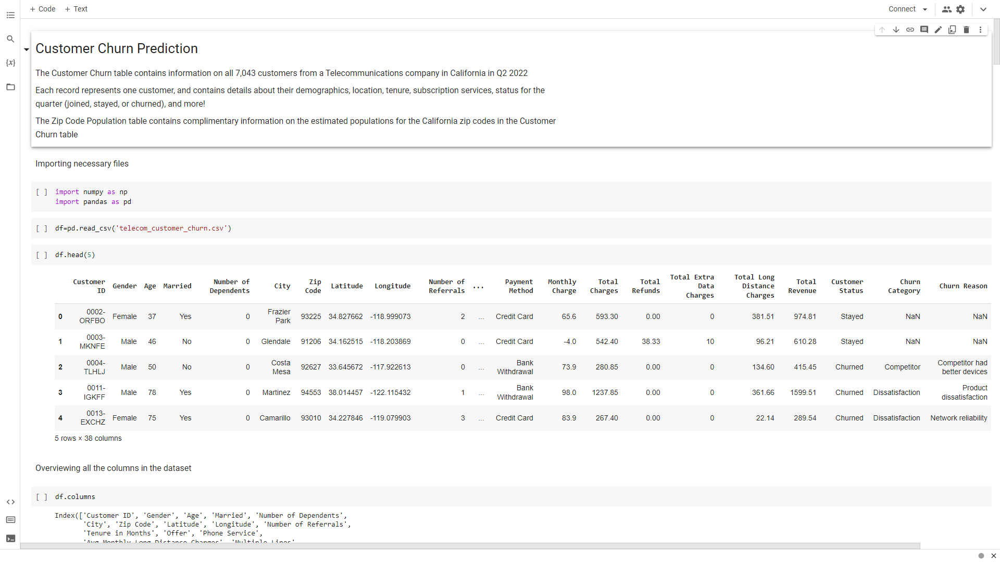
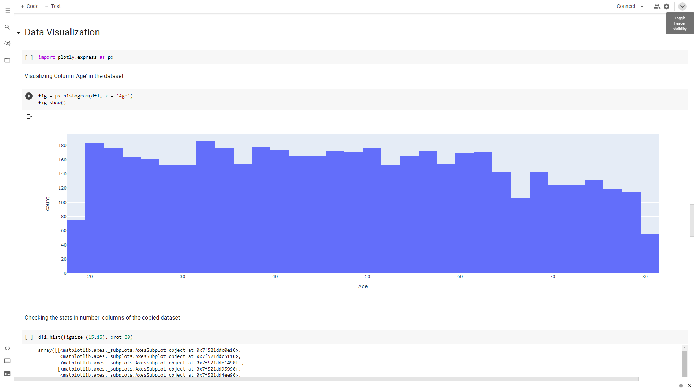
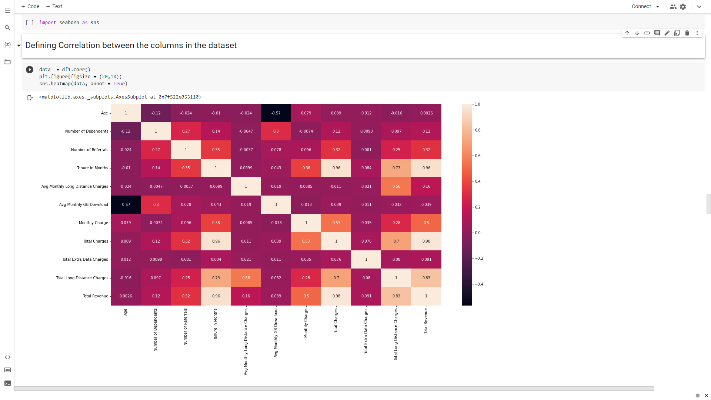
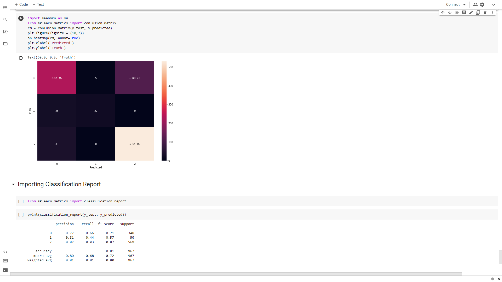

# 📊 Customer Churn Prediction using Machine Learning

<p align="center">


</p>

---

# 📖 About The Project

Customer Churn Prediction is an end-to-end Machine Learning project that predicts whether a telecom customer is likely to **Churn**, **Stay**, or **Join** the company based on customer demographics, subscription details, account information, and service usage.

The project demonstrates the complete Machine Learning workflow, including:

- Data Cleaning
- Exploratory Data Analysis (EDA)
- Feature Engineering
- Data Preprocessing
- Model Training
- Model Evaluation
- Customer Churn Prediction

---

# 📌 Problem Statement

Customer retention is one of the biggest challenges in the telecom industry. Acquiring new customers costs significantly more than retaining existing ones.

Using historical customer information, this project builds predictive machine learning models capable of identifying customers who are at risk of leaving the company.

### Business Benefits

- 🎯 Identify customers at high risk of churn
- 📞 Improve customer retention strategies
- 💰 Reduce revenue loss
- 📈 Increase customer lifetime value
- 📊 Support business decision-making

---

# 📂 Dataset Information

The dataset contains information about **7,043 telecom customers**.

### Features Included

- Customer Demographics
- Geographic Location
- Customer Tenure
- Phone Services
- Internet Services
- Contract Type
- Payment Method
- Monthly Charges
- Total Charges
- Customer Status (Target Variable)

---

# 🚀 Machine Learning Pipeline

```text
Dataset
   │
   ▼
Data Cleaning
   │
   ▼
Exploratory Data Analysis
   │
   ▼
Feature Engineering
   │
   ▼
Encoding
   │
   ▼
Feature Scaling
   │
   ▼
Train-Test Split
   │
   ▼
Model Training
   │
   ▼
Model Evaluation
   │
   ▼
Prediction
```

---

# 📸 Project Overview

## Dataset Overview



---

## Exploratory Data Analysis



---

## Feature Analysis



---

## Model Evaluation



---

# 🛠️ Tech Stack

| Category | Technologies |
|-----------|--------------|
| Programming Language | Python |
| Notebook | Jupyter Notebook |
| Data Analysis | Pandas, NumPy |
| Visualization | Matplotlib, Seaborn |
| Machine Learning | Scikit-Learn, XGBoost |

---

# 🤖 Machine Learning Models

| Model | Accuracy |
|--------|----------|
| Logistic Regression | **78.28%** |
| Decision Tree | **77.29%** |
| Random Forest | **78.11%** |
| Gaussian Naive Bayes | **36.77%** |
| XGBoost Classifier | **81.09% ⭐** |

---

# 📊 Model Evaluation Metrics

The models were evaluated using:

- Accuracy Score
- Precision
- Recall
- F1 Score
- Confusion Matrix
- Classification Report

---

# 📈 Exploratory Data Analysis

The project includes:

- Customer Status Distribution
- Gender Distribution
- Contract Analysis
- Internet Service Analysis
- Monthly Charges Analysis
- Total Charges Analysis
- Correlation Heatmap
- Tenure Analysis
- Feature Importance

---

# 📁 Project Structure

```text
Customer-Churn-Prediction
│
├── README.md
├── LICENSE
├── .gitignore
│
└── Customer_Churn_Prediction
    │
    ├── Assets
    │   ├── 1.png
    │   ├── 2.png
    │   ├── 3.png
    │   └── 4.png
    │
    ├── DataSets
    ├── Src
    └── Customer_Churn_Prediction.ipynb
```

---

# ⚙️ Installation

Clone the repository

```bash
git clone https://github.com/Venkatesh868817/Customer-Churn-Prediction.git
```

Navigate into the repository

```bash
cd Customer-Churn-Prediction
```

Install the required libraries

```bash
pip install -r requirements.txt
```

Open Jupyter Notebook

```bash
jupyter notebook
```

---

# 🎯 Applications

This project can be used by telecom companies to:

- Predict customer churn
- Improve customer retention
- Reduce customer acquisition costs
- Build personalized marketing campaigns
- Support strategic business decisions

---

# 📊 Results

- ✔ Successfully cleaned and preprocessed customer data.
- ✔ Conducted detailed exploratory data analysis.
- ✔ Built multiple classification models.
- ✔ Compared model performances.
- ✔ **XGBoost achieved the highest accuracy of 81.09%.**

---

# 🔮 Future Improvements

- Hyperparameter Tuning
- Cross Validation
- Feature Selection
- Streamlit Dashboard
- FastAPI Deployment
- Docker Containerization
- Cloud Deployment (AWS)

---

# 📦 Required Libraries

```text
numpy
pandas
matplotlib
seaborn
scikit-learn
xgboost
jupyter
```

Install using:

```bash
pip install -r requirements.txt
```

---

# 👨‍💻 Author

## Sangem Venkatesh

🎓 B.Tech – Computer Science & Engineering

💼 Aspiring Data Analyst | Machine Learning Enthusiast

---

# 🌐 Connect With Me

<p align="left">

<a href="https://github.com/Venkatesh868817">

</a>

<a href="https://www.linkedin.com/in/sangem-venkatesh-7ba284301/">

</a>

</p>

---
